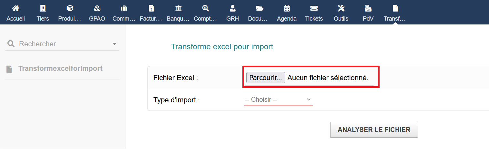

# TransformExcelForImport

## Sommaire

[Présentation](#présentation)

[Informations principales](#informations-principales)

[Fonctionnalités](#fonctionnalités)

[Installation](#installation)

[Utilisation](#utilisation)

[utilisation produit](#produit)

[utilisation BOM](#bom)

[Format attendu du fichier Excel](#format-attendu-du-fichier-excel)

[Contraintes sur les caractères](#contraintes-sur-les-caractères)

[Exemple](#exemple)

[Bonnes pratiques](#bonnes-pratiques)

[Limitations connues](#limitations-connues)

[Tables Dolibarr utilisées](#tables-dolibarr-utilisées)

[Support et contribution](#support-et-contribution)

[Suggestions d’amélioration](#suggestions-damélioration)

## Présentation
TransformExcelForImport est un module Dolibarr permettant d’importer facilement des produits, d’ajouter des prix fournisseurs et de les intégrer dans des nomenclatures (BOM) via un simple fichier Excel. Il est conçu pour simplifier la gestion de volumes importants de données tout en restant accessible.

## Informations principales
- **Nom du module** : TransformExcelForImport  
- **Version** : 1.0  
- **Auteur** : apelet  
- **Compatibilité** : Dolibarr ≥ 18.x  
- **Contact / site** : 

## Fonctionnalités
- Import automatique de produits depuis un fichier Excel

- Liaison aux catégories existantes dans Dolibarr

- Intégration dans une nomenclature si précisée

- Interface simple et contrôles d’import

## Installation

### I. instalation manuel 
#### 1. Copier le dossier `transformexcelforimport` dans `htdocs/custom/`
#### 2. Activer le module dans Dolibarr via :

    Accueil → Configuration → Modules / Applications

### II. instalation automatique
#### 1. Depuis l'accueil aller dans Configuration

#### Maintenant aller dans Modules/Applications

#### Pour finir aller dans Déployer/Installer un module externe

#### Il ne reste plus qu'a mettre le .zip et a cliquer sur Envoyer fichier

## Utilisation

### Produit
#### 1. Aller dans la hot-bar cliquer sur l'icone representant une feuille de papier

#### 2. Vous arrivez sur la page suivante

#### 3. Importer un fichier Excel respectant le format ci-dessous

#### 4. Choisisez le type d'import (produit ou  BOM )

Dans le cas de l’ajout de produits, il faut choisir un fournisseur (de préférence créé exprès) qui sera lié au produit à l’achat.

#### 5. Vérifier les données 

__Seules les lignes non présentes en base de données sont affichées.__
Si aucun produit n’est à ajouter, un message s’affiche.

#### 6. Confirmer l’import en appuyant sur le bouton importer

### BOM
#### 1. Aller dans la hot-bar cliquer sur l'icone représentant une feuille de papier

#### 2. Vous arrivez sur la page suivante

#### 3. Importer un fichier Excel respectant le format ci-dessous

#### 4. Choisisez le type d'import (produit ou  BOM )

Dans le cas de l’ajout dans une BOM, il faut choisir une nomenclature déjà créée et à l’état de brouillon.

#### 5. Vérifier les données 

##### Ajout dans une BOM vide

##### Ajout dans une BOM contenant déjà des produits

* Les lignes en orange sont celles existantes mais avec une différence entre ce qui est stocké et le fichier Excel. L’utilisateur peut choisir quelle information sera conservée via la case à cocher (si elle est cochée, la valeur retenue sera celle du fichier Excel).

* Les lignes en jaune (à remplacer si c’était orange deux fois) sont celles existantes sans différence dans la quantité.

##### Ajout avec un produit n'étant pas en bd

#### 6. Confirmer l’import en appuyant sur le bouton importer

## Format attendu du fichier Excel
Le fichier doit contenir ces colonnes (noms en minuscules) :

| Colonne        | Obligatoire | Description |
|----------------|-------------|-------------|
| `Référence`    | Oui         | Référence unique du produit (caractères autorisés : a–z, A–Z, 0–9, `-`) |
| `Description`  | Oui         | Description libre |
| `Type`         | Oui         | Nom d'un  tag qui sera lier au produit lors de son ajout si le tag existe déjà en bd  |
| `Fabricant`    | Non         | Donne une information qui est mis dans la ref du produit (caractères autorisés : a–z, A–Z, 0–9, `-`) |
| `Quantité`     | Oui         | Quantité pour la nomenclature |
| `Indice  `     | Non         | permet de donner des indices par exemple planXXXX_`Indice`  |

## Contraintes sur les caractères
- `Référence` et `Fabricant` : lettres (a–z, A–Z), chiffres (0–9) et `-` uniquement
- `Description` : texte libre
- `Type` : doit correspondre à une catégorie déjà créée dans Dolibarr
-  `Quantité` et `Indice` : numériques uniquement

## Exemple

## Bonnes pratiques

* Vérifier que catégories et fournisseurs existent

* Utiliser des références uniques

* Vérifier l’encodage UTF-8

* Tester d’abord avec un petit fichier

## Limitations connues

* Pas de liberté dans la logique ni dans les noms de colonnes

## Tables Dolibarr utilisées

* llx_product

* llx_product_fournisseur_price

* llx_categorie, llx_categorie_product

* llx_bom_bomline

## Support et contribution

Auteur : apelet

Dépôt Git :  

## Suggestions d’amélioration

* Contrôles d’import plus détaillés

* Support de champs supplémentaires

* choix des noms de colonnes, logique dans le parametrage du module pour une plus grande utilisation

